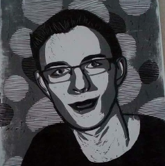

# Tobiáš Krupa

* * *

## Student

Tobiáš Krupa  
* student of doctoral studies, programme Mathematical modelling  
* Charles University, Faculty of Mathematics and Physics

* * *

## Teaching

### Current semester Summer - 2025/26
Winter semester
* [Mathematics for Physicists I](https://tattobiti.github.io/MpFI)

### [Archive of past courses]

* * *

## Contact

* phone number: *** *** *55  
* e-mail: Tobias.Krup@seznam.cz  
* [github](https://github.com/Tattobiti)  
* [CV](cv.pdf)
