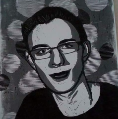

# Tobiáš Krupa

* * *

## Student

Tobiáš Krupa  
* student of Doctoral study programme - Mathematical and Computer Modeling  
* Charles University, Faculty of Mathematics and Physics

* * *

## Teaching

### Current semester - Summer 2025/26
* [Mathematics for Physicists II](https://tattobiti.github.io/MpFII)

### [Archive of past courses](https://tattobiti.github.io/Archive)

* * *

## Contact

* phone number: *** *** *55  
* e-mail: Tobias.Krup@seznam.cz  
* [github](https://github.com/Tattobiti)  
* [CV](New_CV_Tobias_Krupa.pdf)
